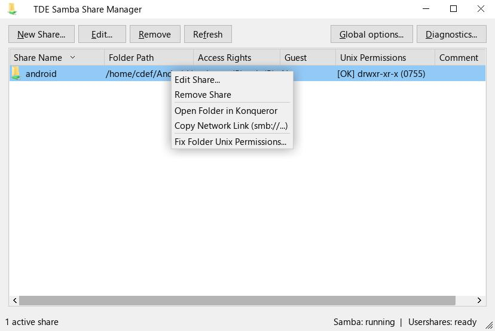
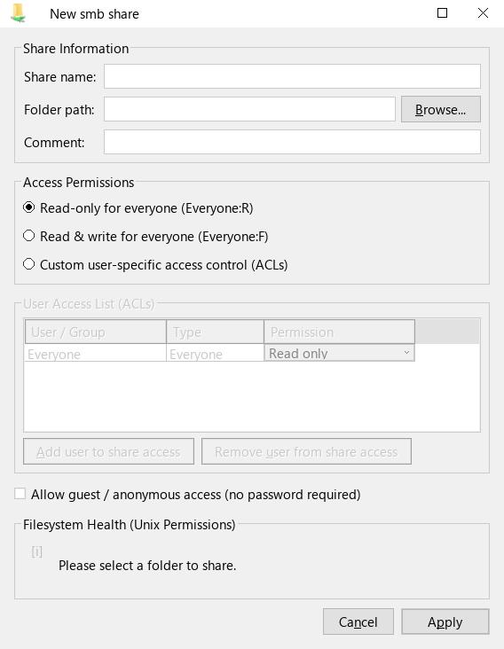
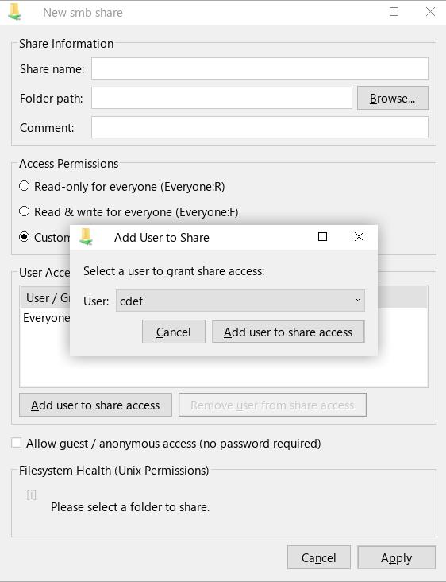
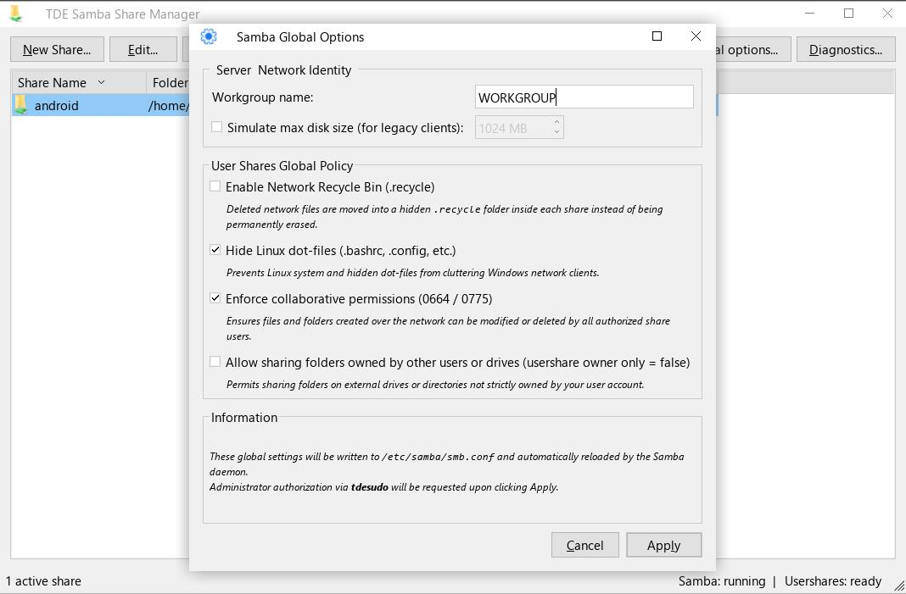
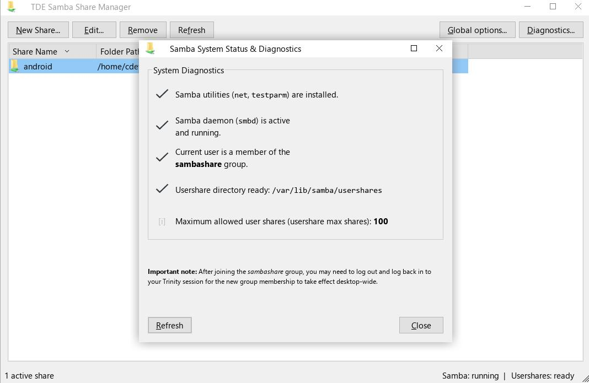

# tdeshare — Samba Network Shares Manager for Trinity Desktop (TDE)

`tdeshare` is a lightweight, native **TQt3 / TDE** graphical utility for the **Trinity Desktop Environment** that allows users to easily share local directories over Samba without directly modifying `/etc/samba/smb.conf`.

---

## Key Features

### 1. User-Level Share Management (`net usershare`)
- Create, modify, and remove user network shares without root privileges.
- Changes take effect immediately in the running `smbd` daemon without requiring a full service restart.
- Seamless compatibility with Windows, macOS, and Linux Samba/SMB clients.

### 2. Access Control & Multi-User ACLs
- **Simple Mode**: One-click presets for *Read Only for everyone* (`Everyone:R`) or *Read & Write for everyone* (`Everyone:F`).
- **Advanced Mode / Interactive ACL Table**: Assign granular permissions to specific local system users:
  - *Full access (Read / Write)*
  - *Read only*
  - *Denied*
- **Guest Access**: Optional anonymous access without passwords (`guest_ok=y/n`).

### 3. Live Filesystem Health & Permissions Helper
- Automatically inspects folder permissions (`stat`/`chmod`) and parent directory traversal to verify if network users and guests can actually access the directory on disk.
- Clear, real-time diagnostic reporting.
- One-click permission remediation button to safely adjust Unix directory masks (`0755`, `0775`, `0777`).

### 4. Samba Global Options & Policies (`GlobalOptionsDialog`)
- **Server & Network Identity**: Easily change the Windows Workgroup name (`workgroup = ...`).
- **Disk Quota Simulation**: Restrict apparent share sizes (`max disk size = <MB>`) for legacy network clients.
- **Network Recycle Bin**: Transparently move deleted network files to `.recycle` within each share via Samba VFS (`vfs objects = recycle`).
- **Dot-Files Privacy**: Automatically hide Linux hidden files (`hide dot files = yes`) from Windows network browsers.
- **Collaborative Group Permissions**: Enforce cohesive file creation and directory masks (`create mask = 0664`, `directory mask = 0775`).
- **Atomic Template Validation**: Applies settings via `usershare template share` in `/etc/samba/smb.conf`, validated with `testparm -s` before applying.

### 5. System Diagnostics & Subsystem Monitoring
- **Integrated Diagnostics Dialog (`DiagDialog`)**:
  - Verifies presence of required Samba binaries (`net`, `testparm`).
  - Detects running status of the `smbd` system service (with 1-click startup).
  - Checks user membership in the `sambashare` group (with 1-click elevation).
  - Checks availability and permissions of the usershares spool directory (`/var/lib/samba/usershares`).
  - Automatically loads native Trinity desktop theme icons (`checkmark`, `stop`) without hardcoded file paths.
- **Live Status Bar**:
  - Displays live daemon status (`running`, `reloading...`, `stopped`), usershare subsystem readiness (`ready`, `pending...`, `setup required`), and active share counts.

### 6. Security & Privilege Architecture
- **Root Execution Guard (Pre-TDE Interception)**:
  - Intercepts root execution (`sudo tdeshare` or `uid == 0`) before `TDEApplication` initializes, preventing configuration file permission corruption in `~/.trinity` (`root:root` ownership) and avoiding orphaned usershares.
  - Displays a clean, informative advisory dialog directing administrators to edit `/etc/samba/smb.conf` or run as a normal user.
- **Strictly Scoped Privileges**:
  - Everyday share management is completely non-privileged (`sg sambashare`).
  - Privileged actions (starting `smbd`, group onboarding, global options) use polished `tdesudo` prompts with appropriate contextual icons (`--icon "dialog-password" -i "network"`).

---

## File Manager Integration

`tdeshare` integrates directly into Trinity file managers:

- **Supported File Managers**: Konqueror, Dolphin, d3lphin, and Krusader.
- **Top-Level Context Menu**: Adds a Windows-style **"Share..."** (`Partager...`) entry directly at the top level of the right-click context menu on any folder (`X-TDE-Priority=TopLevel`).
- **Standalone Folder Mode**: When invoked from a file manager context menu (`tdeshare <folder>` or `%U`), opens only the specific folder share dialog without cluttering the screen with the main window. If changes are confirmed, the main management window opens with the newly configured share highlighted.
- **Asynchronous Folder Browsing**: Right-clicking on an existing share in `tdeshare` allows opening it in Konqueror/Dolphin asynchronously via a detached process without freezing the GUI.

> **Automated File Manager Integration**:
> Both the Debian package (`.deb`) and the Q4OS installer (`.qsi`) automatically detect installed file managers (Konqueror, Dolphin, d3lphin, Krusader) upon installation to register actions seamlessly, and clean them up automatically upon uninstallation.

---

## Command Line Usage

```bash
# Open the main management window
tdeshare

# Directly open the share dialog for a folder (local path or file:// URL)
tdeshare /path/to/my/folder
tdeshare file:///path/to/my/folder

# Directly open the system diagnostics dialog
tdeshare --diag

# Directly open the dialog to create a new share
tdeshare --new-share

# Display version or CLI help
tdeshare --version
tdeshare --help
```

---

## Building & Optimization

The build process uses aggressive size and speed optimization flags tailored for Trinity Desktop applications.

### Requirements
- `cmake` (>= 3.10)
- `pkg-config`
- `tqt-mt` (TQt3 libraries and headers)
- `tdecore`, `tdeui` (Trinity Desktop libraries and headers)
- `tqmoc` (Trinity Qt Meta-Object Compiler)
- `sstrip` (optional, for post-link ELF stripping)

### Build Instructions

```bash
# Build the standalone binary:
./build.sh
```

### Packaging (.deb & .qsi)

Generate production packages with a single command:

```bash
# Build the Debian package (.deb):
./build_deb.sh 1.0

# Build the complete Q4OS installer (.qsi):
./build_qsi.sh 1.0
```
- **Debian Package (`tdeshare_<version>_amd64.deb`)**: ~42 KB compressed, handles dependencies (`samba`, `tdecore`, `tqt3-mt`, `python3`) and installs file manager actions dynamically.
- **Q4OS Installer (`setup_tdeshare_<version>.qsi`)**: ~94 KB standalone graphical installer wizard with embedded visuals and automatic Sycoca integration.

### Compiler Optimization Highlights
- **Global `-Os` & LTO Driver**: Compiles all units and drives link-time code generation with `-Os -flto=auto` for a compact memory footprint and optimal CPU L1 instruction cache efficiency.
- **Full RTTI Retention**: Preserves C++ Runtime Type Information (`dynamic_cast` / `typeid`) to guarantee 100% crash-free compatibility with Trinity theme and widget style engines (such as `q4win10.so` and `KStyle`).
- **Dead Code Stripping**: Section garbage collection (`-Wl,--gc-sections`), hidden inline visibility (`-fvisibility-inlines-hidden`), and dead string table pruning.
- **Compact Binary**: Produces an ultra-lightweight standalone binary (~**140 KB**).

---

## Screenshots

| | | |
| :---: | :---: | :---: |
| <a href="screenshots/screenshot_1.jpg"></a> | <a href="screenshots/screenshot_2.jpg"></a> | <a href="screenshots/screenshot_3.jpg"></a> |
| <a href="screenshots/screenshot_4.jpg"></a> | <a href="screenshots/screenshot_5.jpg"></a> | |

---

## License

This project is licensed under the **GNU General Public License v2 (GPLv2)**.
